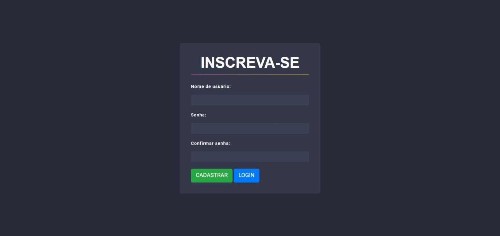
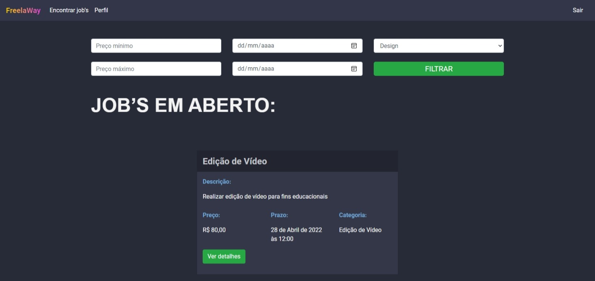
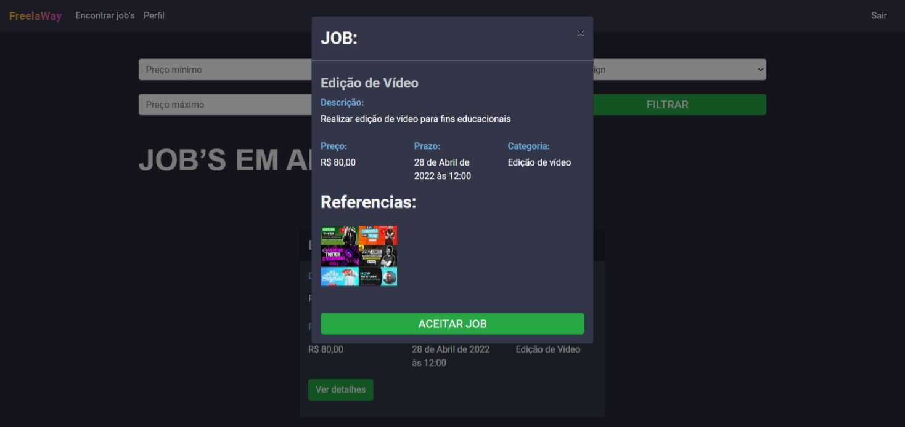
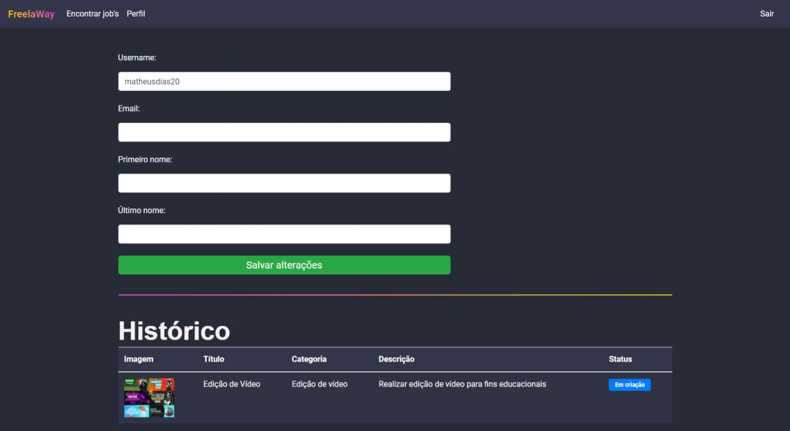

<h1 align="center">👨‍💻 Freelaway</h1>

  <strong>A aplicação consiste em um site para freelancers encontrarem trabalhos. Nele é possível se cadastrar e logar com um usuário e aceitar trabalhos freelas, e enviar o trabalho concluído para o cliente dentro da própria plataforma.</strong>
    
    
  Freelaway é um um site para freelancers desenvolvido durante a Pythonstack Week 3.0, evento organizado pela Pythonando.

  
  
  
  

## Linguagens: 🚀

- Python
- Django
- HTML
- CSS
- Bootstrap
- Banco de dados: SQlite3

## Referências: ⌨️

- [Figma](https://www.figma.com/file/evD9GozIjqlfS70a0GHBcz/Untitled?node-id=0%3A1)
